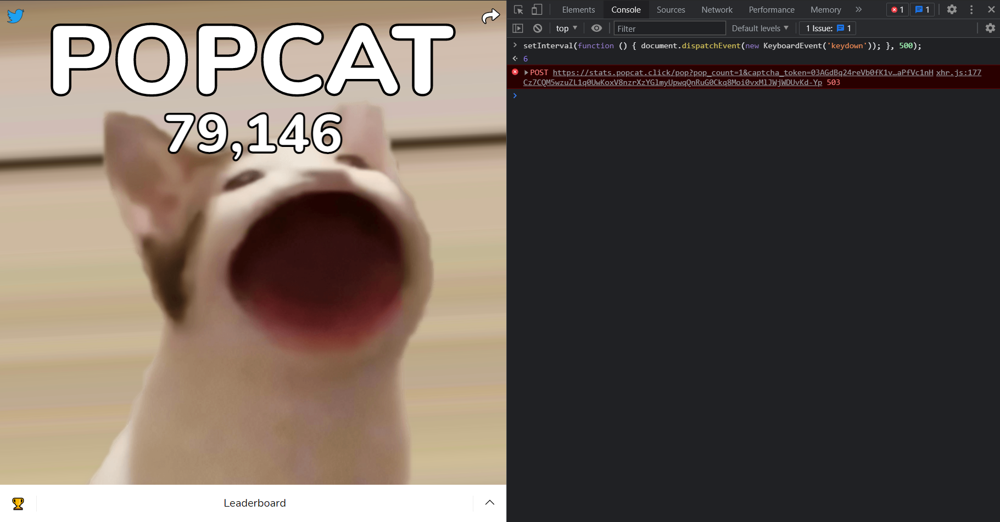

# 自動點擊啵啵貓 `POPCAT-Auto-Click`



## 使用說明
* 瀏覽器開啟`https://popcat.click`
* 按下`F12`, 選到`Console`
* 貼上下面程式碼, 按下Enter

## 程式碼
```js
// 0.5秒 觸發鍵盤
setInterval(function () { document.dispatchEvent(new KeyboardEvent('keydown')); }, 500);
```

## 程式說明
* 整個網站 document 建立事件 
* 建立 KeyboardEvent Object 實作事件內容為: 按下按鍵 (Keydown)
* 最後使用 setInterval 循環定時器觸發以上動作